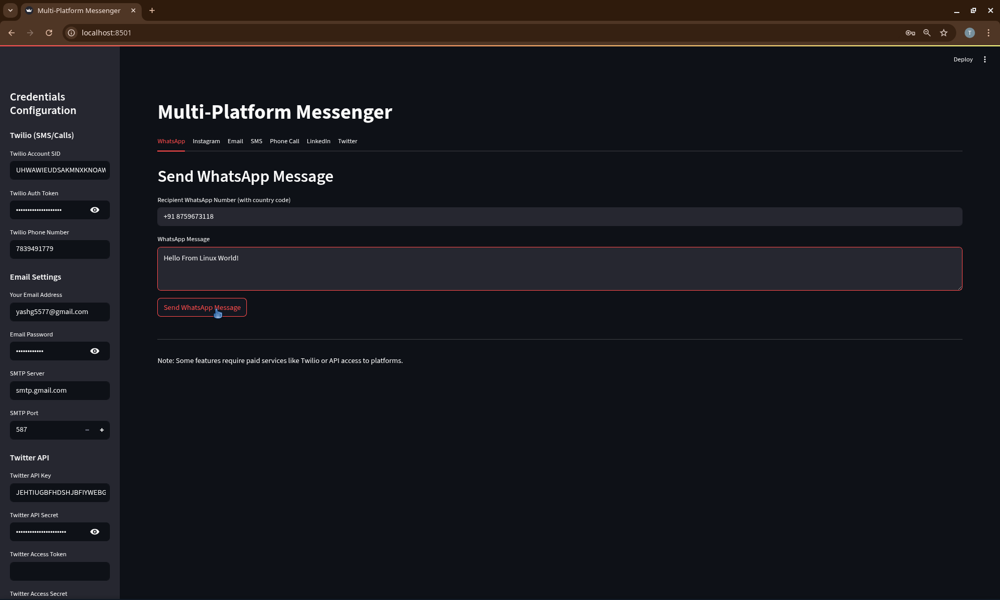
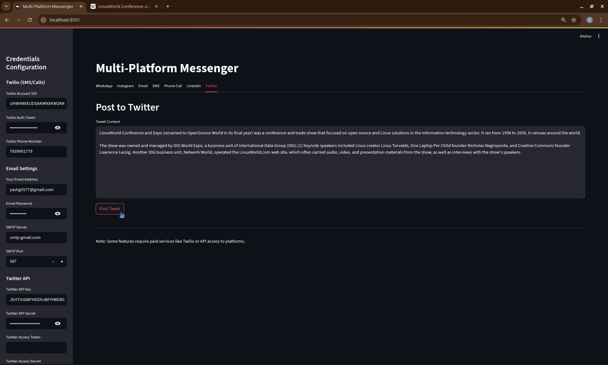

# Multi-Platform Messenger

A Streamlit-based application that allows you to send messages across multiple platforms including WhatsApp, Instagram, Email, SMS, Phone Calls, LinkedIn, and Twitter.



## Features

- **WhatsApp Messaging**: Send messages to WhatsApp contacts
- **Instagram Messaging**: (Limited functionality) Send messages to Instagram users
- **Email**: Send emails with subject and body
- **SMS**: Send text messages to phone numbers
- **Phone Calls**: Make automated phone calls with text-to-speech
- **LinkedIn**: Create posts on your LinkedIn profile
- **Twitter**: Post tweets to your Twitter account





## Prerequisites

Before you begin, ensure you have the following:

1. Python 3.7+ installed
2. Accounts and API access for:
   - Twilio (for SMS, Phone Calls, and WhatsApp)
   - Email SMTP credentials
   - Twitter Developer Account
   - LinkedIn Developer Account
3. Required API keys and access tokens

## Installation

1. Clone the repository:

   ```
   git clone https://github.com/yourusername/multi-platform-messenger.git
   cd multi-platform-messenger
   ```
   
Create and activate a virtual environment:

```bash
python -m venv venv
source venv/bin/activate  # On Windows use `venv\Scripts\activate`
```

Install the required packages:

```
pip install -r requirements.txt
```
Or install them manually:


```
pip install streamlit twilio requests tweepy python-linkedin
```

Configuration
Rename .env.example to .env and fill in your credentials:

text
# Twilio Credentials
TWILIO_ACCOUNT_SID=your_account_sid
TWILIO_AUTH_TOKEN=your_auth_token
TWILIO_PHONE_NUMBER=your_twilio_number

# Email Credentials
EMAIL_ADDRESS=your_email@example.com
EMAIL_PASSWORD=your_email_password
SMTP_SERVER=smtp.example.com
SMTP_PORT=587

# Twitter API
TWITTER_API_KEY=your_api_key
TWITTER_API_SECRET=your_api_secret
TWITTER_ACCESS_TOKEN=your_access_token
TWITTER_ACCESS_SECRET=your_access_secret

# LinkedIn API
LINKEDIN_ACCESS_TOKEN=your_linkedin_token
For better security in production, consider using Streamlit's secrets management instead of environment variables.

Usage
Run the application:

```
streamlit run app.py
```

The app will open in your default browser at http://localhost:8501

Configure your credentials in the sidebar

Use the tabs to navigate between different messaging platforms

Fill in the required information and send your messages


